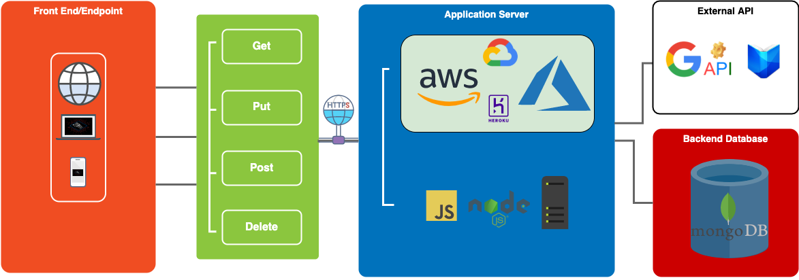

<p align="center">
  
</p>

# CLUBLIT! :books:


The place where readers come together to network and talk with their favorite authors and like-minded peers over voice. 
_#QuarantineandChill #StayHomeStaySafe #togetherandhome_

[](https://clublit.azurewebsites.net/)

## Table of Contents
- [About](#about)
- [System Architecture](#system-architecture)
- [Backend](#backend)
  - [Cloud App](#cloud-app)
    - [Google Cloud](#google-cloud)
    - [Microsoft Azure](#microsoft-azure)
    - [Heroku](#heroku)
  - [Running Locally](#running-locally)
    - [Local Node.js Installation](#local-node-installation)
    - [NVM](#nvm)
    - [Docker Container](#docker-container)
 - [Front-end](#front-end)
 - [Disclaimer](#disclaimer)


## About 

CLUBLIT! is a drop-in-audio social media for book lovers and a platform that unites all readers to discuss their favorite novels and engage with fellow readers and authors in a community.
We bring great minds together to discuss and share their reading experiences through co-reading, live readings, and online audio events. 
Our app assists you with the search for new potential reads and creates your customized wish lists. 

__Note:__ Not all features are available in the current release. This platform is developed in stages; the first and current version of the MVP (minimum viable product) demonstrates a backend developed in Node.js with CRUD operations for user accounts stored on a cloud-based MongoDB. Interaction with the external Google API REST service is used for querying book information allowing this information to be added to user's accounts. Concerning security mechanisms, the users' information follows salted and hash-based authentication. Furthermore, all our current cloud deployments have an RSA TLS (Azure) and SHA2 (Heroku) signed HTTPS certificate. For a local SSL deployment see [Running Locally](#running-locally). 

## System Architecture
<p align="center">
  
</p>
The front-end serves as a seamless user interface for IOS 14 and android (planned in a future release).
The backend is a REST-based service interface for CRUD operations (for example, data query of books, user sign up & login, POST, PUT) deployed via Elastic Beanstalk to AWS to facilitate scalable performance and Microsoft Azure as well as Heroku. The node server interacts with Google Books API. Furthermore, our system uses a NoSQL external Cloud database (MongoDB) to securely store our community user information (salted and hashed). 

## Backend
It is advisable to use [Postman](https://www.postman.com/) for CRUD operations when acccessing the backend.
### Cloud App
Our current backend is accessible as a cloud application :rocket: on [Google Cloud](#google-cloud), [Azure](#microsoft-azure) and [Heroku](#heroku). 
Feel free to check them out!

#### Google Cloud
[](http://35.233.107.125:3000)

This is our load balanced deployment!

To deploy a load-balanced application with Kubernetes, the following approach can be followed by having logged into the cloud console and created a new project. 

##### Pre-Checks
First, launch the cloud shell and clone the repository by:
``` 
git clone https://github.com/nahidtopalovic/library_api.git
```
Navigate into the repository by typing 
```
cd library-api
```
Verify your project ID (note you must change ``PROJECT_ID`` with your project ID, which can be found by typing ``gloud projects list``)

```
export PROJECT_ID= PROJECT_ID
```
Once applied, test it with the following command. 
```
export PROJECT_ID= PROJECT_ID
```
Now you may copy-paste the following commands without adjusting.

##### Creating the Docker Image
<p align="left">
  
</p>
Create our docker image with the "Dockerfile" from our repository by:

```
docker build -t gcr.io/${PROJECT_ID}/clublit:v1 .
```

List your Docker images to verify.
```
docker images
```
##### Pushing the Docker image to the Container Registry
Now we are required to enable the [Container Registy API](https://console.cloud.google.com/apis/library/containerregistry.googleapis.com); please note that this may require further adjustments from your API settings to turn on the Kubernetes API (check out the Google Cloud [API manager](https://cloud.google.com/apis)).   
```
gcloud services enable containerregistry.googleapis.com
```
Furthermore, we need to authorize the docker configuration.
```
gcloud auth configure-docker
```
Now we push the image
```
docker push gcr.io/${PROJECT_ID}/clublit:v1
```
#### Creating a GKE cluster
Setting the project ID:
```
gcloud config set project $PROJECT_ID
```

Setting the zone or region (Europe as an example, adjust to your needs).
```
gcloud config set compute/zone europe-west1-b 
```
Creating our Standard Cluster:
```
gcloud container clusters create clublit-cluster
```

Checking the cluster's three nodes
```
kubectl get nodes
```
#### Deploying CLUBLIT! to GKE
Ensuing the connection to the appropriate cluster:
```
gcloud container clusters get-credentials clublit-cluster --zone europe-west1-b 
```
Creating the deployment
```
kubectl create deployment clublit --image=gcr.io/${PROJECT_ID}/clublit:v1
```

Setting a baseline to three deployment replicas
```
kubectl scale deployment clublit --replicas=3
```

Creating a HorizontalPodAutoscaler:
```
kubectl autoscale deployment clublit --cpu-percent=80 --min=1 --max=5
```

Checking if our pods are created successfully:
```
kubectl get pods
```

#### Exposing CLUBLIT! to the internet
In our case, we require port 3000, as our development .env file contains information to connect to MongoDB set to port 3000.

```
kubectl expose deployment clublit --name=clublit-service --type=LoadBalancer --port 3000 --target-port 3000
```

Verify that the services are running :
```
kubectl get service
```
Note that it may require you to wait until you can see your public IP address if it is saying ``<pending>``. 

#### Delete the Service,  Cluster & Images
If you are done testing our educational application you may follow these steps:
```
kubectl delete service clublit-service
```
```
gcloud container clusters delete clublit-cluster --zone europe-west1-b
```
```
gcloud container images delete gcr.io/${PROJECT_ID}/clublit:v1  --force-delete-tags --quiet
```

More information can be found in this tutorial: [Google cloud Kubernetes Engine Documentation](https://cloud.google.com/kubernetes-engine/docs/tutorials/hello-app#cloud-shell)


#### Microsoft Azure

[](https://clublit.azurewebsites.net/)

This deployment is currently not load balanced yet but supports an HTTPS certificate. 


#### Heroku
[](https://clublit.herokuapp.com/)

This deployment is currently not load balanced yet but supports an HTTPS certificate. 
      


NOTE: It is advisable to use [Postman](https://www.postman.com/) for CRUD operations when acccessing the backend.

### Running Locally
To run this repository on your local machine download the source code and extract its contents or clone the repository.
We provide you with a few options shipped with this repository. 

For a local SSL connection you may generate your own certificate into the root directory ``openssl req -x509 -newkey rsa:4096 -keyout key.pem -out cert.pem -days 365`` of the repository and add the following code into the index.js file:
```
//This enables https

const https = require("https");
const fs = require("fs");

const options = {
    key: fs.readFileSync("key.pem"),
    cert: fs.readFileSync("cert.pem")
  };
  ```

**Option 1:**  Starting a local server with your node.js installation running in **version 14.13.0**.  

**Option 2:** Using ``` nvm```.
If you have node.js already installed but are not running node version 14.13.0, you may wish to switch between node.js versions using `` nvm `` ([nvm instrcutions](#nvm)).  

**Option 3:** Using Docker.

#### Local Node Installation
[Node.js](https://nodejs.org/en/) is required. 

1. In your terminal navigate to the downloaded or cloned repository. 
```
cd library_api | bash
```

2. To install missing depdencies: 
```
npm install
```

3. To start the application:
```
npm start
```


#### NVM 
Switching between node versions to run this app locally on your machine. 

Installing nvm on mac:
```
curl -o- https://raw.githubusercontent.com/nvm-sh/nvm/v0.38.0/install.sh | bash
```
Adding the source lines from the snippet below to the correct profile file:

```
export NVM_DIR="$([ -z "${XDG_CONFIG_HOME-}" ] && printf %s "${HOME}/.nvm" || printf %s "${XDG_CONFIG_HOME}/nvm")"
[ -s "$NVM_DIR/nvm.sh" ] && \. "$NVM_DIR/nvm.sh" # This loads nvm
```
Installing node.js version 14.13:
```
nvm install 14.13
```

Selecting node.js 14.13:
``` 
nvm use 14.13
```

For more information, see: [nvm documentation](https://github.com/nvm-sh/nvm)

#### Docker Container
<p align="left">
  
</p>

1. Install [Docker](https://docs.docker.com/get-docker/) and verify your installation with ``` docker -v ```
2. Launch the terminal in the library_api folder or direct to this directory.
3. Build the docker image (be sure to include the ". " at the end and to define your username ``` whoami```)

```
docker build -t <your username>/clublit . 
```

4. Run your container:
```
docker run -it -p 3000:3000 <your username>/clublit 
```

This will map port 3000 to the host 3000 in our container. 

5. Access the backend from your browser via ``http://localhost:3000``

More info: [Dockerizing a Node.js web app](https://nodejs.org/en/docs/guides/nodejs-docker-webapp/) 


## Front-end
<p align="left">
  
</p>

The current version of the front-end can only be ran locally. It was successfully tested on macOS Big Sur launched over the command line. The IOS simulator or Android emulator can be launched through the web interface of the local server. [Node.js](https://nodejs.org/en/) is required alongside with the respective Node version, please see [nvm](#nvm) and [docker](#docker-container) section above in further detail.

To launch the front end, navigate into the front-end folder of the repository. 
```
cd front-end
```

Install dependencies.
```
npm install
```

Start the front-end node.js server by typing:
```
npm start
```

You may be asked to install further dependencies to run the IOS simulator ([Xcode](https://developer.apple.com/xcode/) required) or android emulator. 

<!-- ### Disclaimer -->
###### Disclaimer
This project is part of a cloud computing coursework taught by [Dr. Sukhpal Singh Gill](https://github.com/iamssgill) and [Ignacio De Castro Arribas](https://www.linkedin.com/in/ignacio-de-castro-arribas-44a48117) at the Queen Mary University of London Electrical Engineering & Computer Science Department to create a prototype of a cloud application._
